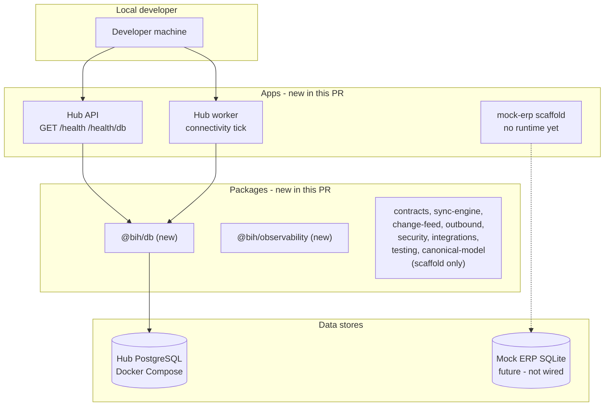
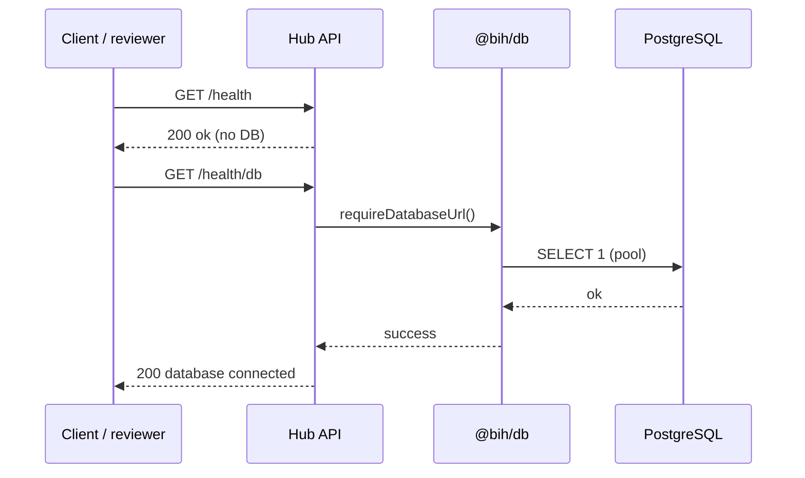

# Pull Request Review Guide

**TASK-1.1 — Bootstrap Hub repository and local runtime**

---

## At a glance

| Field | Value |
| --- | --- |
| **PR / branch** | Bootstrap Business Integration Hub workspace for TASK-1.1. (`task/1.1-bootstrap-hub-runtime` → `master`) |
| **Author** | mkerbel |
| **Link** | https://github.com/mosheKerbel/business-integration-hub/pull/1 |
| **Change type** | infra |
| **Suggested review time** | **M** (45–75 min for first-time Hub reviewers; **S** if experienced with pnpm monorepos) |
| **Related work** | Implementation plan **TASK-1.1**; PRD / Technical Spec v0.2 (on `master` under `docs/`) |

---

## Executive summary

This pull request turns the documentation-only repository into a **buildable pnpm monorepo** with strict TypeScript, minimal **API** and **worker** processes, local **Hub PostgreSQL** via Docker Compose, and smoke tests. It delivers the foundation for later epics (contracts, canonical schema, sync engine, Mock ERP behavior) without implementing business APIs or ERP integration.

Reviewers should confirm that the workspace layout matches the technical design, that secrets are not committed, that Hub Postgres is isolated from future Mock ERP SQLite, and that a clean checkout can **install → build → typecheck → test → run dev processes** using the README.

### In scope (this PR)

- Monorepo skeleton: `apps/{api,worker,mock-erp}`, `packages/*`, `migrations/`, `tests/`
- Root tooling: `build`, `lint`, `typecheck`, `test`, `dev:api`, `dev:worker`, `db:*`
- Strict TypeScript base config across workspaces
- `@bih/db` connectivity helpers (`pg`, `SELECT 1` smoke check)
- `@bih/observability` structured JSON logging
- API: `GET /health`, `GET /health/db` (native `node:http`)
- Worker: periodic DB connectivity tick (placeholder until sync/outbox)
- Docker Compose for Hub PostgreSQL; `.env.example` (no real secrets)
- Vitest smoke tests (startup + optional DB integration via `RUN_DB_INTEGRATION=1`)
- Public npm registry via `.npmrc`

### Out of scope (not in this PR)

- Canonical Customer/Product/Price/Assortment tables or domain migrations
- Sync engine, change feed, outbound command engine
- Consumer authentication and Hub business HTTP APIs
- Heshbonit / Hashavshevet adapters
- Mock ERP HTTP/SQLite behavior (scaffold export only)
- Provider credentials / KMS, scheduler, deployment target
- OpenAPI / codegen choice for `packages/contracts`

---

## What changed (high level)

`master` currently contains only product and engineering docs. This branch adds **one commit** (~60 files, ~3k lines) that wires the **Business Integration Hub** as an independent TypeScript service platform: shared packages are mostly **scaffold exports**, while **db**, **observability**, **api**, and **worker** contain the only meaningful runtime logic. Tooling and README document how developers bootstrap Postgres and run quality checks.

### Touch areas

| Area | What changed | Reviewer note |
| --- | --- | --- |
| **Workspace** | pnpm workspaces, `@bih/*` packages, composite `tsconfig` | Names and folder layout vs Technical Spec §2; no provider logic in core packages |
| **API** (`apps/api`) | Minimal HTTP server, health endpoints | No auth; `/health/db` exposes error messages to caller—acceptable for local dev only |
| **Worker** (`apps/worker`) | Poll loop + DB ping | Fails softly on tick (warn log); confirm this matches interim expectations |
| **Database** (`packages/db`, `docker-compose`) | Pool helper, compose Postgres 16 | Dev credentials in compose/example only; port `15432` default; no RLS/migrations yet |
| **Mock ERP** (`apps/mock-erp`) | Placeholder module only | Must not reference Hub `DATABASE_URL` |
| **Tests** | Startup smoke, config smoke, gated DB test | Default `pnpm test` does not require Docker |
| **Supply chain** | `pnpm-lock.yaml`, public `.npmrc` | Lockfile integrity; no private Intuit registry |

---

## Architecture (diagram)

### System context



_Caption: Hub API and worker share `@bih/db` against **Hub PostgreSQL** only; Mock ERP remains isolated for later tasks._

### Critical flow (health check)



---

## Risk and blast radius

| Risk | Likelihood | Impact | Mitigation / what to verify |
| --- | --- | --- | --- |
| Accidental commit of `.env` with secrets | Low | High | `.gitignore` includes `.env`; review diff for credentials |
| Wrong repo layout confuses future tasks | Medium | Medium | Compare tree to Technical Spec §2; `integrations/erp/` placeholder present |
| Mock ERP coupled to Hub DB | Low | High | Confirm `mock-erp` has no `DATABASE_URL` / `pg` usage |
| Dev-only DB password in compose | Expected | Low | Documented local-only; not production config |
| `checkDatabaseConnection` opens pool per call | Medium | Low | Acceptable for smoke; note for later connection pooling |
| Large lockfile churn | Low | Low | Normal for initial bootstrap; skim for unexpected packages |

**Deployment / rollout:** None. No cloud or CI definitions in this PR (verify separately if CI is added on GitHub).

---

## How to review this PR (step by step)

Follow this order so you validate **scope and operability** before line-level style comments.

### Phase 1 — Intent and scope (5–10 min)

- [ ] Read [PR #1](https://github.com/mosheKerbel/business-integration-hub/pull/1) description and implementation plan **TASK-1.1** (`docs/business_integration_hub_implementation_plan_v0.2.md`).
- [ ] Confirm single commit on branch: `92644bf` — bootstrap only; `master` remains docs-only (`62f2855`).
- [ ] Scan diff stat: ~60 files, no deletions; no unrelated product repos.

### Phase 2 — Structure and boundaries (10–20 min)

- [ ] Verify monorepo paths: `apps/api`, `apps/worker`, `apps/mock-erp`, required `packages/*`, `migrations/`, `tests/`.
- [ ] Open scaffold packages: exports should be neutral (no ERP/B2B business logic).
- [ ] Confirm `.npmrc` points at public npm registry.
- [ ] Read `.env.example` and `docker-compose.yml`: `BIH_POSTGRES_PORT` aligns with `DATABASE_URL` host port.

### Phase 3 — Correctness (15–25 min)

- [ ] `apps/api/src/index.ts` — routing, error handling on `/health/db`, no business routes.
- [ ] `apps/worker/src/index.ts` — shutdown signals, poll interval validation (`>= 1000` ms).
- [ ] `packages/db/src/index.ts` — pool lifecycle (`pool.end()` in `finally`).
- [ ] `packages/observability` — log levels, no secret fields logged by default.

### Phase 4 — Tests and verification (15–25 min)

- [ ] Read `tests/smoke/process-startup.test.ts` — API `/health` without `DATABASE_URL`; worker starts.
- [ ] Read `tests/integration/database.connection.test.ts` — gated on `RUN_DB_INTEGRATION=1`.
- [ ] Run locally:

```bash
cd /path/to/business-integration-hub
pnpm install
cp .env.example .env
pnpm db:up
pnpm build
pnpm typecheck
pnpm lint
pnpm test
export RUN_DB_INTEGRATION=1
pnpm test
pnpm dev:api    # separate terminal: curl http://127.0.0.1:3000/health
curl http://127.0.0.1:3000/health/db
pnpm dev:worker
```

- [ ] If `pnpm db:up` fails on port bind, adjust `BIH_POSTGRES_PORT` and `DATABASE_URL` per README.

### Phase 5 — Security and compliance (5–10 min)

- [ ] No production secrets in git.
- [ ] `/health/db` error JSON may include connection errors—fine for local dev; flag if exposed beyond dev later.
- [ ] No consumer auth (expected omission for TASK-1.1).

### Phase 6 — Operability (5–10 min)

- [ ] `README.md` matches scripts in root `package.json`.
- [ ] `migrations/` is placeholder only—no false expectation of schema rebuild yet.

### Phase 7 — Final pass

- [ ] Comment on blockers vs follow-ups (TASK-1.2+).
- [ ] Approve when bootstrap acceptance criteria in TASK-1.1 are met.

---

## Reviewer checklist (quick)

- [ ] Scope matches TASK-1.1 only
- [ ] Repo root layout is flat (`docs/`, `apps/`, not nested `business-integration-hub/docs/`)
- [ ] No secrets committed
- [ ] `pnpm test` passes without Docker; DB test passes with `RUN_DB_INTEGRATION=1` when Postgres is up
- [ ] API and worker start without provider credentials
- [ ] README documents bootstrap clearly

---

## Questions for the author

1. Is GitHub Actions (or other CI) planned immediately after merge, or in a follow-up task?
2. Should `/health/db` be restricted or toned down before any non-local deployment?
3. Confirm `master` on remote was force-updated to flat layout so this PR compares cleanly (one commit ahead).

---

## Optional findings (from guide prep — not a full code review)

| Severity | Item |
| --- | --- |
| **Question** | Worker logs warnings on every failed tick when `DATABASE_URL` is unset—is that noisy for local `dev:worker` without `.env`? |
| **Nit** | API does not parse query strings on `url` (strict path match)—fine for current routes. |

---

## Appendix

### Commands reference

| Action | Command |
| --- | --- |
| Install | `pnpm install` |
| Hub Postgres | `pnpm db:up` / `pnpm db:down` |
| Build | `pnpm build` |
| Typecheck | `pnpm typecheck` |
| Lint | `pnpm lint` |
| Test (default) | `pnpm test` |
| Test + DB | `RUN_DB_INTEGRATION=1 pnpm test` |
| Dev API | `pnpm dev:api` |
| Dev worker | `pnpm dev:worker` |

### Glossary

| Term | Meaning in this PR |
| --- | --- |
| **Hub PostgreSQL** | Integration platform database (Docker Compose); separate from Mock ERP |
| **TASK-1.1** | Foundation bootstrap epic—workspace + local runtime only |
| **Scaffold package** | Workspace wired with placeholder export; implementation deferred |

---

_Generated with the `pr-review-helper` Cursor skill. Update if the branch changes before merge._
