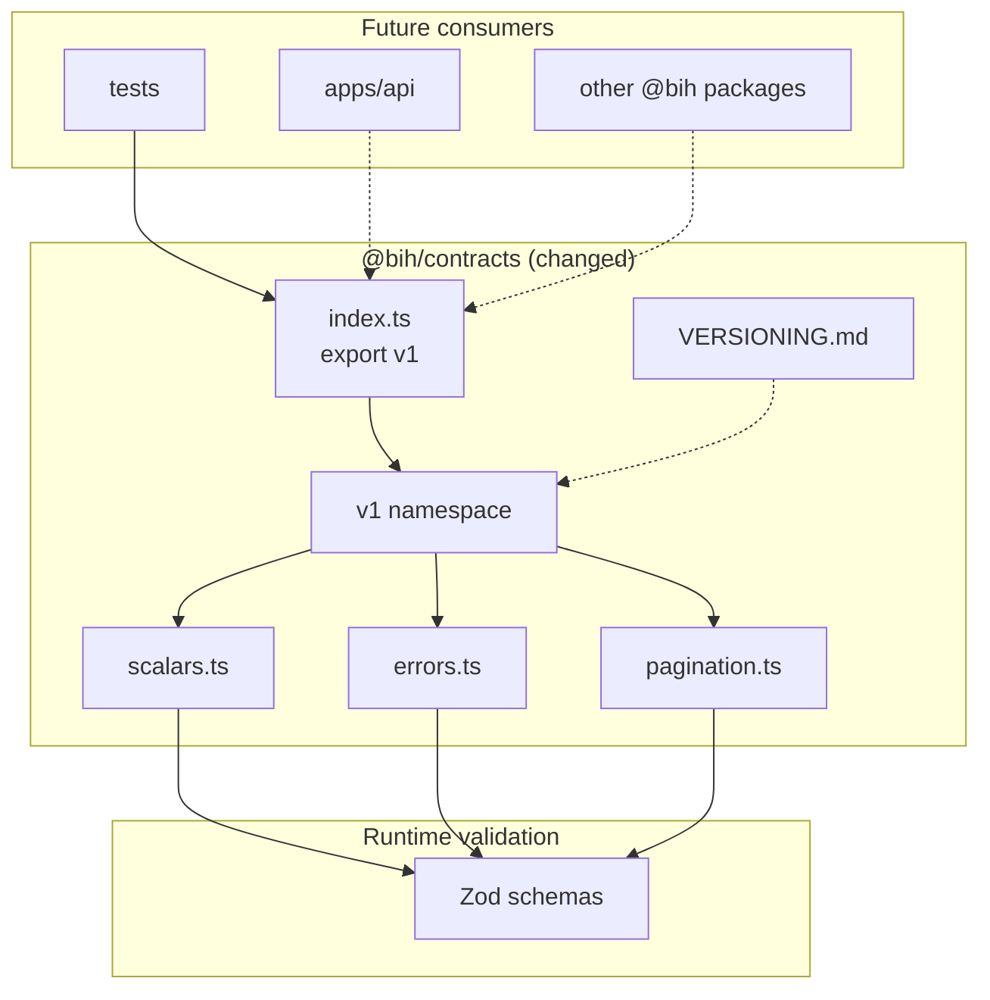
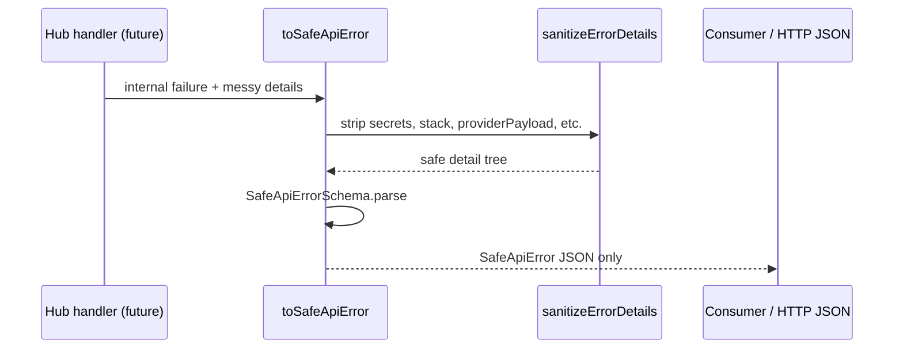

# Pull Request Review Guide

**TASK-1.2 — Define versioned shared contract package**

---

## At a glance

| Field | Value |
| --- | --- |
| **PR / branch** | Define versioned shared contracts package for TASK-1.2 (`task/1.2-shared-contracts` → `master`) |
| **Author** | mkerbel |
| **Link** | _Create PR after push_ |
| **Change type** | feature |
| **Suggested review time** | **S** (30–45 min); **M** if this is your first read of Hub contract rules |
| **Related work** | Implementation plan **TASK-1.2**; depends on **TASK-1.1** (merged); unblocks **TASK-1.3** / **TASK-1.4** |

---

## Executive summary

This pull request replaces the `@bih/contracts` scaffold with a **runtime-validated `v1` namespace**: shared scalars (UUID, timestamps, cursors, money, request IDs), **safe public API errors**, bounded **pagination** metadata, and documented **versioning rules**. Validation uses **Zod** as the single contract stack (no OpenAPI/codegen). The change is confined to `packages/contracts` and tests; no HTTP routes, entity DTOs, or provider fields are introduced.

Reviewers should confirm that invalid boundary values are rejected, money stays decimal-safe (no floats), public errors cannot leak credentials or raw provider payloads, and the versioning doc matches implementation-plan expectations for additive vs breaking changes.

### In scope (this PR)

- `packages/contracts` **`v1`** export (`@bih/contracts` and `@bih/contracts/v1`)
- Zod schemas + inferred types for shared scalars, pagination, and `SafeApiError`
- `toSafeApiError` / `sanitizeErrorDetails` / `serializeSafeApiError`
- `packages/contracts/VERSIONING.md`
- Vitest coverage in `tests/contracts/v1-contracts.test.ts`; workspace smoke updated

### Out of scope (not in this PR)

- Customer, Product, CustomerPrice, CustomerAssortment, Financial, history, Order/Return DTOs (**TASK-1.3**)
- Consumer context / binding / authorization (**TASK-1.4**)
- API route wiring, sync engine, change feed, outbound engine
- OpenAPI or alternate contract generators
- Provider-specific or B2B/Sales workflow fields

---

## What changed (high level)

After TASK-1.1, `@bih/contracts` exported only a placeholder constant. This branch adds ~550 lines focused on **provider-neutral public primitives** that later entity schemas will compose. The root package re-exports `v1` and `CONTRACT_API_VERSION`. One new runtime dependency (`zod`) is added only to `@bih/contracts`.

### Touch areas

| Area | What changed | Reviewer note |
| --- | --- | --- |
| **`packages/contracts/src/v1/scalars.ts`** | UUID, ISO-8601, cursor, canonical version, currency, money, request/correlation ID | Money uses `numeric(18,4)`-style string rules; no `number` for amounts |
| **`packages/contracts/src/v1/errors.ts`** | `SafeApiError`, sanitization helpers | Forbidden key patterns; depth/key limits; no stack in schema |
| **`packages/contracts/src/v1/pagination.ts`** | Default limit 100, max 500, `after` cursor | Aligns with change-feed example max; default is conservative |
| **`VERSIONING.md`** | Additive vs breaking rules | Becomes normative for future `v2` |
| **Tests** | Scalar/error/pagination cases + import smoke | Proves sanitization strips secrets/provider payloads |
| **Workspace smoke** | Imports `v1` instead of `CONTRACTS_PACKAGE` | Only consumer of removed scaffold export |

---

## Architecture (diagram)

### Contract package layout (new)



_Caption: Public Hub contracts flow through the **`v1`** namespace; entity DTOs will extend these primitives in TASK-1.3._

### Safe error boundary (review focus)



---

## Risk and blast radius

| Risk | Likelihood | Impact | Mitigation / what to verify |
| --- | --- | --- | --- |
| **Breaking** removal of `CONTRACTS_PACKAGE` export | Low | Low | Only smoke test used it; replaced in same PR |
| **Incomplete** sanitization allows leak via novel key names | Medium | High | Review `FORBIDDEN_DETAIL_KEY` and tests; extend list if needed |
| **Money** accepted as invalid decimal strings | Low | Medium | `MoneyAmountSchema` tests + `serializeMoney` normalization |
| **Pagination** string coercion surprises (`limit: "010"`) | Low | Low | `Number()` behavior documented; add test if concerned |
| **Zod** version lock-in for all future DTOs | Expected | Medium | Plan already treats `packages/contracts` as source of truth |
| Lockfile adds one dependency | Low | Low | `zod@3.25.76` only under `@bih/contracts` |

**Deployment / rollout:** None. Library-only change; no config or migration.

---

## How to review this PR (step by step)

### Phase 1 — Intent and scope (5–10 min)

- [ ] Read implementation plan **TASK-1.2** (`docs/business_integration_hub_implementation_plan_v0.2.md`).
- [ ] Confirm diff stays inside `packages/contracts`, `tests/contracts`, `tests/smoke/workspace.test.ts`, and `pnpm-lock.yaml`.
- [ ] Verify no entity DTOs, provider names, or Heshbonit/Hashavshevet concepts.

### Phase 2 — Structure and boundaries (10–15 min)

- [ ] `package.json` exports: `.`, `./v1`, `./VERSIONING.md`.
- [ ] Read `VERSIONING.md` for breaking vs additive rules—matches team expectations?
- [ ] Confirm Zod is not duplicated in other packages yet.

### Phase 3 — Correctness (15–25 min)

- [ ] `packages/contracts/src/v1/scalars.ts` — cursor/request ID control-char checks; canonical version as non-negative integer **string** (JSON-safe).
- [ ] `packages/contracts/src/v1/errors.ts` — `toSafeApiError` never copies stack; nested forbidden keys stripped.
- [ ] `packages/contracts/src/v1/pagination.ts` — bounds `1..500`, default `100`, optional `after` cursor uses `CursorSchema`.

### Phase 4 — Tests and verification (10–15 min)

- [ ] Read `tests/contracts/v1-contracts.test.ts` — invalid UUID/timestamp/cursor/currency/money/limit cases.
- [ ] Run locally:

```bash
cd /path/to/business-integration-hub
pnpm install
pnpm build
pnpm typecheck
pnpm lint
pnpm test
```

- [ ] Optional: `node -e "import { v1 } from '@bih/contracts'; console.log(v1.CONTRACT_API_VERSION)"` from repo root after build.

### Phase 5 — Security and compliance (5–10 min)

- [ ] Safe error tests assert no `password`, `apiKey`, `providerPayload`, `stack` in serialized output.
- [ ] No secrets in fixtures or committed env files.

### Phase 6 — Operability (5 min)

- [ ] No README change required for this library-only task; `VERSIONING.md` is the operator-facing contract doc.

### Phase 7 — Final pass

- [ ] Approve when TASK-1.2 acceptance criteria are met and TASK-1.3 can import `v1` scalars without rework.

---

## Reviewer checklist (quick)

- [ ] Scope matches TASK-1.2 only
- [ ] `v1` namespace stable and importable from root and `/v1`
- [ ] Runtime validation on all exported boundary schemas
- [ ] Money is string-decimal, not floating point
- [ ] Safe errors documented and tested for leak prevention
- [ ] `pnpm test`, `typecheck`, `lint` pass

---

## Questions for the author

1. Should `ErrorCodeSchema` eventually narrow to a closed enum for documented Hub codes, or stay an open `SCREAMING_SNAKE` pattern for forward compatibility?
2. Is default pagination limit **100** (vs max **500** in the technical spec example) intentional for all list endpoints, or should change-feed defaults differ in TASK-1.3?
3. Any need to export `containsAsciiControlCharacter` or keep it module-private?

---

## Optional findings (from guide prep — not a full code review)

| Severity | Item |
| --- | --- |
| **Question** | `SafeApiErrorSchema` allows `details` as `Record<string, unknown>` after sanitization—should values be restricted to JSON primitives only at schema level? |
| **Nit** | `normalizeMoneyAmount` strips trailing zeros—confirm consumers expect normalized form in API responses. |

---

## Appendix

### Commands reference

| Action | Command |
| --- | --- |
| Install | `pnpm install` |
| Build | `pnpm build` |
| Typecheck | `pnpm typecheck` |
| Lint | `pnpm lint` |
| Test | `pnpm test` |

### Glossary

| Term | Meaning in this PR |
| --- | --- |
| **`v1`** | Stable public contract namespace; breaking changes require `v2` |
| **SafeApiError** | Machine-readable code + safe message/details for HTTP consumers |
| **CanonicalVersion** | Non-negative integer string for `hub_version` / change metadata |
| **TASK-1.2** | Shared contract primitives only; entity DTOs deferred |

---

_Generated with the `pr-review-helper` Cursor skill. Update if the branch changes before merge._
