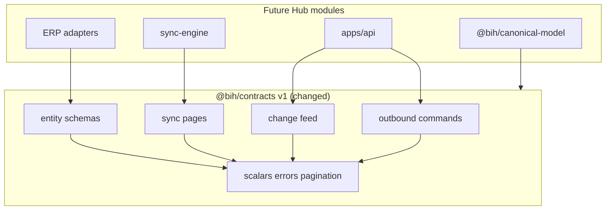
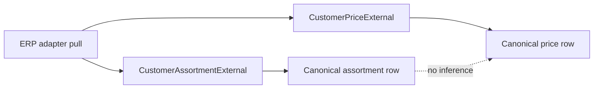

# Pull Request Review Guide

**TASK-1.3 — Define canonical data and outbound DTO contracts**

---

## At a glance

| Field | Value |
| --- | --- |
| **PR / branch** | Define canonical data and outbound DTO contracts for TASK-1.3 (`task/1.3-canonical-dto-contracts` → `master`) |
| **Author** | mkerbel |
| **Link** | _Create PR after push_ |
| **Change type** | feature |
| **Suggested review time** | **M** (45–75 min); **L** if first deep read of Hub canonical entity rules |
| **Related work** | Implementation plan **TASK-1.3**; depends on **TASK-1.2** (merged); unblocks **TASK-2.2**, **TASK-3.1**, **TASK-1.4** (parallel) |

---

## Executive summary

This pull request adds **runtime-validated v1 canonical DTOs** to `@bih/contracts`: inbound entities (Customer, Product, CustomerAssortment, CustomerPrice, financial snapshots/open documents, external sales history), adapter-facing `*External` shapes, **SyncPage** wrappers with high-water metadata, **change-feed items**, and strict **Order/Return** commands plus **ExternalDocumentResult**. `@bih/canonical-model` now depends on contracts and re-exports v1 types for Hub modules. Validation reuses TASK-1.2 Zod primitives (money, UUID, timestamps, cursors, safe errors); no new contract stack or HTTP routes.

Reviewers should confirm **CustomerAssortment and CustomerPrice stay independent**, outbound commands reject unknown/provider-specific keys (`.strict()`), money remains decimal-safe, freshness metadata is present on canonical rows, and tests cover B2B/Sales minimum fixtures plus safe error serialization on document results.

### In scope (this PR)

- New `packages/contracts/src/v1/*` entity modules and barrel exports in `v1/index.ts`
- `VERSIONING.md` note on canonical entity DTOs and strict outbound commands
- `@bih/canonical-model` workspace dependency on `@bih/contracts` and re-exports
- Vitest suite `tests/contracts/v1-canonical-dto.test.ts`
- `docs/CURSOR_TASK_PROTOCOL.md` advanced to **TASK-1.4**

### Out of scope (not in this PR)

- Consumer context, binding, authorization (**TASK-1.4**)
- DB schema, repositories, sync engine, change-feed HTTP endpoint
- Provider mapping (Heshbonit/Hashavshevet wire fields)
- B2B approval/payment or Sales workflow state on commands
- OpenAPI / code generation

---

## What changed (high level)

TASK-1.2 established shared scalars, pagination, and safe errors. This branch composes those into **provider-neutral entity contracts** aligned with Technical Spec §4 and PRD consumer projections. Persisted canonical shapes share `CanonicalEntityMetadataSchema`; adapter pulls use `InboundEntityBaseSchema` plus `*External` records. Financial adapter pages use a discriminated union (`snapshot` | `open_document`). Outbound sales/return commands require an **approved revision snapshot** and enforce order-level currency consistency on line unit prices.

### Touch areas

| Area | What changed | Reviewer note |
| --- | --- | --- |
| **`common.ts`** | External ID, command ref, idempotency key, quantity, canonical/inbound metadata | Control-char rules mirror cursors; quantities are positive decimal strings |
| **`customer.ts` / `product.ts`** | Canonical + External customer/product with contacts, addresses, UOMs | Minimum fields only—no guessed provider attributes |
| **`customer-assortment.ts` / `customer-price.ts`** | Separate schemas; external pulls use external customer/product IDs | Tests prove assortment-without-price and price-without-assortment |
| **`financial.ts` / `sales-document.ts`** | Snapshots, open documents, history lines | Snapshot currency must match nested money; history lines need product ref |
| **`sync.ts`** | Sync inputs + `createSyncPageSchema` + typed sync page exports | `highWaterMark` optional on pages |
| **`change-feed.ts`** | Entity type enum, operations, `ChangeFeedItem` | Matches PRD §6 / spec §8 fields |
| **`outbound.ts`** | Strict order/return commands, `ExternalDocumentResult` | Unknown keys rejected; no provider payloads on result |
| **`canonical-model`** | Depends on contracts; `canonicalContractsV1` re-export | Build references `../contracts` |
| **Tests** | 13 cases + canonical-model smoke import | Safe error leak test on `ExternalDocumentResult` |

---

## Architecture (diagram)

### v1 contract layers (changed)



_Caption: Entity DTOs **compose** TASK-1.2 primitives; adapters and APIs should import only `v1` public shapes._

### Assortment vs price (review focus)



_Caption: Membership and pricing are **independent facts**; tests must not assume one implies the other._

---

## Risk and blast radius

| Risk | Likelihood | Impact | Mitigation / what to verify |
| --- | --- | --- | --- |
| **Over-scoped** entity fields guessed beyond PRD/spec | Medium | Medium | Compare each field to implementation plan; flag optional attrs without consumer evidence |
| **Strict** outbound rejects forward-compatible clients sending extra JSON | Low | Medium | Intentional for public boundary; document in VERSIONING.md |
| **Financial** union `kind` tag required on adapter pages | Medium | Low | Adapter authors must set discriminator; confirm in TASK-3.x |
| **External** assortment uses external IDs while canonical uses hub UUIDs | Expected | Low | Mapping layer in sync (TASK-2.2) must resolve refs |
| Breaking change to TASK-1.2 exports | Low | High | Existing `v1-contracts.test.ts` still passes |
| New workspace link canonical-model → contracts | Low | Low | `pnpm install` updates lockfile |

**Deployment / rollout:** None. Library-only; no migration or config.

---

## How to review this PR (step by step)

### Phase 1 — Intent and scope (5–10 min)

- [ ] Read implementation plan **TASK-1.3** (`docs/business_integration_hub_implementation_plan_v0.2.md`).
- [ ] Confirm no Heshbonit/Hashavshevet/B2B workflow fields in shared schemas.
- [ ] Scan for unrelated package changes outside contracts, canonical-model, tests, lockfile, docs.

### Phase 2 — Structure and boundaries (10–20 min)

- [ ] `packages/contracts/src/v1/index.ts` exports are grouped and stable for consumers.
- [ ] `VERSIONING.md` entity section matches strict outbound behavior.
- [ ] `@bih/canonical-model` does not duplicate schemas—only re-exports.

### Phase 3 — Correctness (20–35 min)

- [ ] `packages/contracts/src/v1/common.ts` — metadata matches spec §4 row fields.
- [ ] `packages/contracts/src/v1/customer-assortment.ts` — `isActive` semantics; external vs canonical IDs.
- [ ] `packages/contracts/src/v1/outbound.ts` — `.strict()` on commands; currency superRefine on lines.
- [ ] `packages/contracts/src/v1/financial.ts` — snapshot currency alignment with nested money.
- [ ] `packages/contracts/src/v1/sales-document.ts` — line requires `productId` or `productExternalId`.

### Phase 4 — Tests and verification (10–15 min)

- [ ] Read `tests/contracts/v1-canonical-dto.test.ts` and existing `tests/contracts/v1-contracts.test.ts`.
- [ ] Run locally:

```bash
cd /path/to/business-integration-hub
pnpm install
pnpm build
pnpm typecheck
pnpm lint
pnpm test
```

### Phase 5 — Security and compliance (5–10 min)

- [ ] `ExternalDocumentResult` + `toSafeApiError` test: no secrets/provider raw payloads in serialized error.
- [ ] Outbound commands cannot carry arbitrary provider extension properties (strict mode).

### Phase 6 — Operability (5 min)

- [ ] `docs/CURSOR_TASK_PROTOCOL.md` points next work to TASK-1.4 only.

### Phase 7 — Final pass

- [ ] Approve when TASK-1.3 acceptance criteria are met and TASK-2.2 / TASK-3.1 can import entities without rework.

---

## Reviewer checklist (quick)

- [ ] Scope matches TASK-1.3 only
- [ ] All required canonical entities have v1 schemas
- [ ] CustomerAssortment ≠ CustomerPrice in model and tests
- [ ] Money/timestamps/cursors use TASK-1.2 primitives
- [ ] Freshness metadata on canonical entities and change-feed items
- [ ] `pnpm test`, `typecheck`, `lint` pass

---

## Questions for the author

1. Should `CustomerFinancialSnapshot` require at least one of `balance` or `creditLimit`, or is an empty snapshot with only `currency` valid for some adapters?
2. Is `FinancialExternalSchema`’s `kind` discriminator the long-term adapter shape, or will TASK-3.1 split into separate port return types?
3. Are `CustomerContactSchema` / address fields sufficient for Sales minimums, or should TASK-1.3 have included additional optional fields with explicit consumer citations?

---

## Optional findings (from guide prep — not a full code review)

| Severity | Item |
| --- | --- |
| **Question** | `ProductUomSchema.conversionFactor` uses `QuantitySchema` (>0)—is `1` always represented as `"1"` for base UOM? |
| **Question** | `HistorySyncInput.updatedAfter` is optional—confirm incremental history semantics in a later sync task. |
| **Nit** | Consider exporting a single `CANONICAL_ENTITY_TYPES` const array mirroring `ChangeFeedEntityTypeSchema` for DB `entity_type` text consistency. |

---

## Appendix

### Commands reference

| Action | Command |
| --- | --- |
| Install | `pnpm install` |
| Build | `pnpm build` |
| Typecheck | `pnpm typecheck` |
| Lint | `pnpm lint` |
| Test | `pnpm test` |

### Glossary

| Term | Meaning in this PR |
| --- | --- |
| **Canonical entity** | Hub-persisted row with `id`, org, connection, `externalId`, `hubVersion`, sync timestamps |
| **External / inbound** | Adapter-normalized record before or without hub-assigned `id` |
| **CustomerAssortment** | ERP-owned Customer↔Product membership (מגוון), not inferred from price |
| **SyncPage** | Items + pagination meta + optional `highWaterMark` |
| **TASK-1.3** | Entity and outbound DTO contracts only |

---

_Generated with the `pr-review-helper` Cursor skill. Update if the branch changes before merge._
