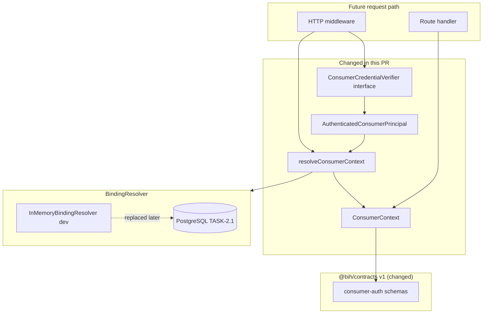
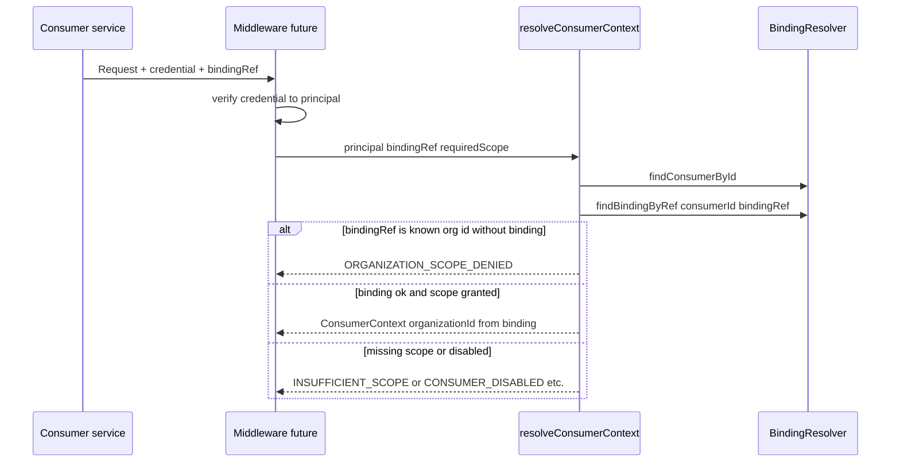

# Pull Request Review Guide

**TASK-1.4 — Define consumer context, binding, and authorization contract**

---

## At a glance

| Field | Value |
| --- | --- |
| **PR / branch** | Define consumer context, binding, and authorization for TASK-1.4 (`task/1.4-consumer-context-binding-authorization` → `master`) |
| **Author** | mkerbel |
| **Link** | _Create PR after push_ |
| **Change type** | feature |
| **Suggested review time** | **M** (35–55 min); **S** if you already reviewed TASK-1.2 contracts |
| **Related work** | Implementation plan **TASK-1.4**; depends on **TASK-1.2** (merged); unblocks **TASK-2.1** (contract dependency), **TASK-3.5** / security tasks that reference consumer context |

---

## Executive summary

This pull request defines **trusted consumer authorization contracts** and **server-side context resolution** before any HTTP middleware or DB-backed bindings exist. `@bih/contracts` gains v1 schemas for `ConsumerContext`, binding/tenant refs, scope names, and authenticated principals. `@bih/security` replaces its scaffold with `BindingResolver`, `resolveConsumerContext(principal, bindingRef, requiredScope)`, typed `ConsumerAuthorizationError` codes, a pluggable `ConsumerCredentialVerifier` interface (no transport implementation), and **B2B / Sales development fixtures**. `apps/api` wires a cached development resolver for future middleware.

Reviewers should confirm **organization scope is never taken from caller-supplied org IDs**, bindings resolve only by **binding id** for the authenticated consumer, raw **organization UUIDs used as `bindingRef`** are rejected with `ORGANIZATION_SCOPE_DENIED`, and scope names cover read / sync / outbound / operations without conflating ERP **capability keys**.

### In scope (this PR)

- `packages/contracts/src/v1/consumer-auth.ts` and v1 barrel exports
- `@bih/security` resolver, context resolution, errors, in-memory registry, dev fixtures
- `apps/api/src/consumer/binding-resolver.ts` (development resolver accessor)
- Vitest `tests/security/consumer-context.test.ts`
- Workspace deps: `@bih/security` → `@bih/contracts`; root + API test/build wiring
- `docs/CURSOR_TASK_PROTOCOL.md` advanced to **TASK-2.1**

### Out of scope (not in this PR)

- Consumer credential transport (mTLS, JWT, signing) — **Decision Required**
- HTTP auth middleware or route handlers using `ConsumerContext`
- PostgreSQL organizations / bindings / connections (**TASK-2.1**)
- Provider credential vault or ERP authorization
- B2B/Sales end-user permissions
- Mapping auth errors to HTTP responses on the API

---

## What changed (high level)

TASK-1.4 establishes the **authorization boundary** described in PRD §7.1 and Technical Spec §3.1: `consumer_tenant_ref` is mapping metadata; the Hub resolves **which organization** a consumer may access only through **bindings** granted on the authenticated consumer principal. Resolution is pure logic over a `BindingResolver` port so TASK-2.1 can swap the in-memory seed for repositories without changing handler contracts.

### Touch areas

| Area | What changed | Reviewer note |
| --- | --- | --- |
| **`consumer-auth.ts`** | Scopes enum, `ConsumerContextSchema`, ref schemas | Scopes are **consumer auth** names, not adapter `capability_key` values |
| **`resolve-consumer-context.ts`** | Core resolution + org-id-as-ref guard | Hot path; all denial branches should map to stable error codes |
| **`in-memory-binding-resolver.ts`** | Seed-backed lookup by `(consumerId, bindingRef)` | `bindingRef` matches binding **id** only in fixtures |
| **`development-consumers.ts`** | `b2b-commerce`, `sales-platform`, deterministic UUIDs | Sales binding omits `read.customer_assortments` intentionally for scope tests |
| **`consumer-authorization-error.ts`** | Error codes align with `ErrorCodeSchema` | Future API layer should map to safe public errors |
| **`credential-verifier.ts`** | Interface only | No verification logic — intentional |
| **`apps/api/.../binding-resolver.ts`** | Singleton dev resolver | Not used by routes yet |
| **`packages/security/src/index.ts`** | Removed `SECURITY_PACKAGE` constant | No remaining imports in repo |

---

## Architecture (diagram)

### Authorization layers (changed)



_Caption: Credential **verification** is pluggable; **binding resolution** and **scope checks** are mandatory before handlers run._

### Context resolution flow (review focus)



---

## Risk and blast radius

| Risk | Likelihood | Impact | Mitigation / what to verify |
| --- | --- | --- | --- |
| **Scope naming** drift vs TASK-2.1 DB seed or future API routes | Medium | Medium | Compare `CONSUMER_SCOPE_VALUES` to implementation plan; flag renames early |
| **`bindingRef` = binding id** vs opaque slug in public API | Medium | Low | Spec shows `:bindingRef` in paths; confirm TASK-2.1 uses same identifier |
| **ORGANIZATION_SCOPE_DENIED** only when org id is in resolver registry | Low | Medium | Unregistered UUID falls through to `BINDING_NOT_FOUND` — acceptable? |
| **Sales** fixture missing assortment read scope | Expected | Low | Test proves `INSUFFICIENT_SCOPE`; not a production config |
| Removed `@bih/security` scaffold export | Low | Low | Grep shows no `SECURITY_PACKAGE` consumers |
| Breaking change to external importers of `@bih/security` | Low | Low | Private monorepo; only API added as dependent |

**Deployment / rollout:** None. Library + test-only wiring; no migration or runtime behavior change on existing routes.

---

## How to review this PR (step by step)

Follow this order so you validate **authorization semantics** before style nits.

### Phase 1 — Intent and scope (5–10 min)

- [ ] Read implementation plan **TASK-1.4** (`docs/business_integration_hub_implementation_plan_v0.2.md`).
- [ ] Confirm PRD **SEC-003 / SEC-004** and Spec §3.1 tenant-ref vs binding story match the code.
- [ ] Confirm no credential transport, middleware, or SQL in this diff.

### Phase 2 — Structure and boundaries (10–15 min)

- [ ] Contracts hold **schemas and scope names**; security holds **resolution logic** — no HTTP in `@bih/security`.
- [ ] `@bih/security` depends on `@bih/contracts` only (not db/api).
- [ ] Dev fixture UUIDs are clearly non-production and documented in fixture file.

### Phase 3 — Correctness (15–25 min)

- [ ] `packages/security/src/resolve-consumer-context.ts` — full denial matrix (disabled consumer/binding, unknown consumer, scope, org-id ref).
- [ ] `packages/contracts/src/v1/consumer-auth.ts` — `ConsumerContext` includes server-resolved `organizationId`; scopes array on context mirrors binding grant.
- [ ] `packages/security/src/in-memory-binding-resolver.ts` — bindings keyed by binding id, not org id or tenant ref.
- [ ] `packages/security/src/fixtures/development-consumers.ts` — B2B vs Sales org isolation; scope differences intentional.

### Phase 4 — Tests and verification (10–15 min)

- [ ] Read `tests/security/consumer-context.test.ts` (cross-consumer, org-id ref, disabled, scope).
- [ ] Run locally:

```bash
cd /path/to/business-integration-hub
pnpm install
pnpm build
pnpm typecheck
pnpm lint
pnpm test
```

### Phase 5 — Security and compliance (10–15 min)

- [ ] No secrets or real tenant credentials in fixtures.
- [ ] Error messages on `ConsumerAuthorizationError` are safe for internal use; confirm future API maps to `SafeApiError` without leaking binding internals.
- [ ] `consumerTenantRef` never used alone to resolve organization in resolver.

### Phase 6 — Operability (5 min)

- [ ] `docs/CURSOR_TASK_PROTOCOL.md` points to TASK-2.1 only.
- [ ] `getDevelopmentBindingResolver()` behavior documented enough for next middleware task.

### Phase 7 — Final pass

- [ ] Approve when TASK-1.4 acceptance criteria are met and TASK-2.1 can persist the same binding shape.

---

## Reviewer checklist (quick)

- [ ] Scope matches TASK-1.4 only
- [ ] Stable `ConsumerContext` type/schema exported from v1
- [ ] Disabled / unbound / cross-consumer cases denied in tests
- [ ] B2B and Sales fixtures resolve only their seeded bindings
- [ ] Raw organization id cannot widen access (explicit test)
- [ ] `pnpm test`, `typecheck`, `lint` pass

---

## Questions for the author

1. Should `bindingRef` in public routes always be the binding row **UUID**, or will TASK-2.1 introduce a separate opaque `binding_key` while keeping UUID internal?
2. Is the split between **consumer scopes** (`read.*`, `sync.*`, `outbound.*`) and ERP **capability_key** (`sales_order.create`) documented clearly enough for adapter authors, or should `VERSIONING.md` gain a short authorization section?
3. For unknown UUIDs that are **not** registered organization ids, is `BINDING_NOT_FOUND` the desired external code, or should clients always see a generic `FORBIDDEN` at the HTTP layer?

---

## Optional findings (from guide prep — not a full code review)

| Severity | Item |
| --- | --- |
| **Question** | `BINDING_CONSUMER_MISMATCH` is unreachable when lookup is scoped by `consumerId`; kept as defense-in-depth — confirm worth keeping. |
| **Question** | Sales dev scopes omit `read.customer_assortments` — document as intentional B2B-only read in fixture comments if not already obvious. |
| **Nit** | Consider exporting `ConsumerAuthorizationErrorCode` values in contracts as documented `ErrorCode` constants for API mapping consistency. |

---

## Appendix

### Commands reference

| Action | Command |
| --- | --- |
| Install | `pnpm install` |
| Build | `pnpm build` |
| Typecheck | `pnpm typecheck` |
| Lint | `pnpm lint` |
| Test | `pnpm test` |

### Glossary

| Term | Meaning in this PR |
| --- | --- |
| **ConsumerContext** | Trusted post-auth view: consumer, binding, **server-resolved** `organizationId`, granted scopes |
| **BindingRef** | Route/input reference resolved to a binding row for the authenticated consumer |
| **ConsumerTenantRef** | Opaque consumer-owned tenant id on the binding; mapping only |
| **Consumer scope** | Hub API authorization grant on a binding (distinct from ERP capability) |
| **TASK-1.4** | Contracts + resolution port + dev fixtures; no transport auth or DB |

---

_Generated with the `pr-review-helper` Cursor skill. Update this doc if the branch changes materially before merge._
